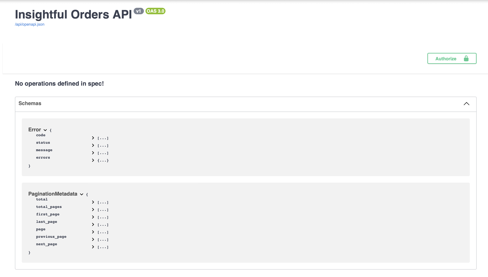
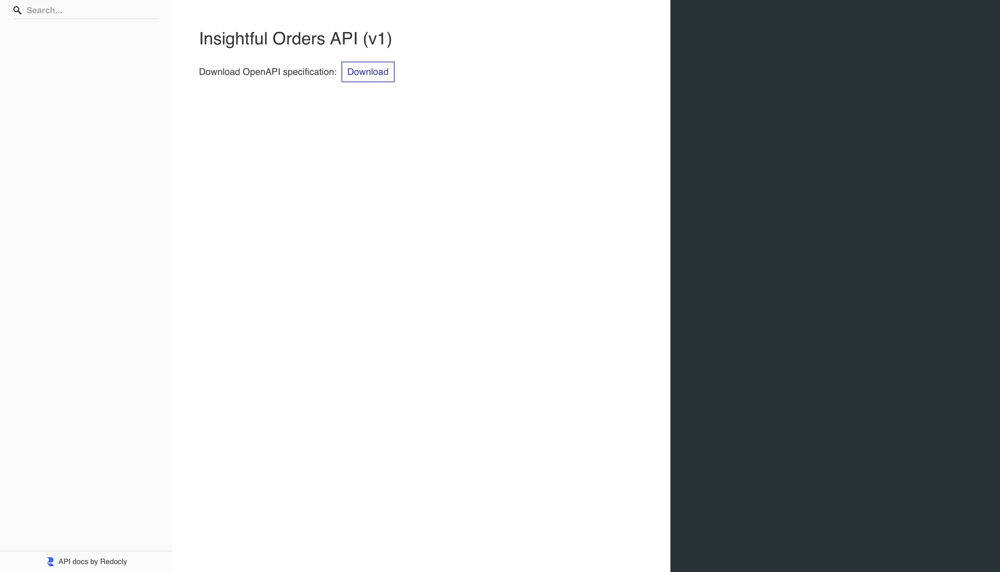

# Insightful-Orders — E-commerce Order-Intelligence API


Insightful-Orders is a containerised Flask microservice that ingests raw Olist order events, stores them in Postgres via SQLAlchemy ORM, calculates business-grade KPIs (rolling AOV, RFM scores, cohort retention), and emits real-time alerts over WebSockets. All endpoints are JWT-secured and documented with an auto-generated OpenAPI spec. The repo ships with a one-command dataset loader, >90% pytest coverage, GitHub Actions CI, and a prod-ready Docker Compose stack.

## Problem

Merchants collect lots of raw order events but lack **actionable insight**:
- What’s the **true AOV trend** over recent weeks?
- Which customers are **most valuable** (RFM) and who is **churning**?
- How do **cohorts retain** month over month?
- How do we **react in real time** when volume spikes or quality drops?

## Solution

**Insightful-Orders** ingests Olist orders into Postgres, computes **business-grade KPIs** (rolling AOV, RFM, monthly cohorts), and emits **real-time alerts** over WebSockets. The API is **JWT-secured**, fully **OpenAPI-documented**, ships with a **one-command dataset loader**, and runs identically in dev/CI via **Docker Compose** with >90% test coverage.

## ✨ Features

- **JWT-secured REST API** with auto docs at `/api/docs` (Swagger) and `/api/redoc`
- **Order analytics:** rolling AOV, RFM scores, monthly cohort retention
- **Real-time alerts** via **Redis pub/sub** → WebSocket
- **Postgres** (durable store) + **SQLAlchemy 2.x**
- **Alembic** migrations; pytest with **90%+ coverage**
- **Docker Compose** dev/prod stack; GitHub Actions CI-ready

## 🧩 Tech Stack

Flask 3 • Flask-Smorest • Marshmallow • SQLAlchemy 2 • Alembic • Postgres 15 • Redis 7 • flask-jwt-extended • Pytest/Factory Boy • Docker/Compose • GitHub Actions

## 📦 Repository Layout

```
insightful-orders/
├─ app/                                   # Flask application package
│  ├─ __init__.py                         # App factory + scheduler bootstrap
│  ├─ cli.py                              # Flask CLI entrypoint + commands
│  ├─ config.py                           # Dev/Test/Prod config classes
│  ├─ extensions.py                       # db, ma, jwt, migrate, redis_client
│  ├─ models.py                           # SQLAlchemy models
│  ├─ schemas.py                          # Marshmallow schemas (request/response)
│  ├─ blueprints/                         # HTTP/WS route modules
│  │  ├─ auth.py                          # /auth register/login/refresh/me
│  │  ├─ metrics.py                       # /metrics aov | rfm | cohorts
│  │  ├─ orders.py                        # /orders list/bulk-create/get/delete
│  │  └─ alerts.py                        # /alerts create/list + /alerts/ws (WebSocket)
│  ├─ services/                           # Domain/business logic
│  │  ├─ analytics.py                     # KPI computations (AOV, RFM, cohorts)
│  │  └─ alerts.py                        # Rule evaluation + Redis publish
│  ├─ utils/                              # Helpers/utilities
│  │  ├─ __init__.py                      # Marks utils as a package
│  │  ├─ auth.py                          # JWT helpers (merchant_id extraction)
│  │  └─ helpers.py                       # paginate(), parse_*(), channel helpers
│  ├─ static/
│  │  └─ alerts.html                      # Minimal browser WS client (dev tool)
│  └─ tools/
│     └─ ws_listen.py                     # CLI WebSocket listener (dev tool)
│
├─ docs/
│  ├─ architecture.md                     # Mermaid architecture diagram
│  ├─ redoc-api-docs.png                  # Redoc snapshot
│  └─ swagger-docs.png                    # Swagger snapshot
│
├─ tests/                                 # Test suites (unit, routes, integrations)
│  ├─ integrations/                       # Integration tests (DB + app context)
│  │  ├─ conftest.py
│  │  ├─ test_alerts_ws.py                # WS handshake + pub/sub delivery
│  │  ├─ test_metrics_endpoints.py        # /metrics endpoints auth + happy paths
│  │  ├─ test_orders_blueprint.py         # /orders blueprint (pagination, bulk, 403s)
│  │  └─ test_orders_edges.py             # Edge cases for /orders
│  ├─ routes/                             # Route smoke tests
│  │  ├─ test_docs.py                     # OpenAPI docs reachable (/api/docs, /api/redoc)
│  │  └─ test_metrics_rfm.py              # /metrics/rfm route shape assertions
│  └─ unit/                               # Pure unit tests (no DB/Redis)
│     ├─ conftest.py                      # SQLite test app + fixtures
│     ├─ factories.py                     # Factory Boy models
│     ├─ test_auth.py                     # Auth flow unit tests
│     ├─ test_alerts.py                   # Alerts predicates + evaluate_rules()
│     ├─ test_analytics_aov.py            # rolling_aov() unit tests
│     ├─ test_analytics_cohorts.py        # monthly_cohorts() unit tests
│     ├─ test_analytics_edge.py           # Edge cases for analytics (NaNs, 0, etc.)
│     ├─ test_analytics_rfm.py            # rfm_scores() unit tests
│     ├─ test_app_init.py                 # App factory init coverage
│     ├─ test_cli.py                      # CLI coverage (manage.py, custom cmds)
│     ├─ test_services_alerts.py          # Unit test for services/alerts.py
│     ├─ test_utils_auth.py               # Unit test for utils/auth.py
│     └─ test_utils_helpers.py            # Unit test for utils/helpers.py
│
├─ .env                                   # Local environment overrides (ignored in git)
├─ .gitignore                             # VCS ignores
├─ .pre-commit-config.yml                 # Linting + secrets hooks
├─ docker-compose.yml                     # Dev stack: api + db + redis
├─ Dockerfile                             # API image (Python 3.11-slim)
├─ LICENSE                                # MIT license
├─ manage.py                              # Flask CLI entrypoint
├─ pytest.ini                             # Pytest config/markers/warnings
├─ README.md                              # This file
└─ requirements.txt                       # Python dependencies
```

## ✅ Prerequisites

- Docker & Docker Compose
- (For demo data) Kaggle API credentials:
  - Add `KAGGLE_USERNAME` and `KAGGLE_KEY` to `.env`  
  - The script `scripts/fetch_olist_data.sh` uses them to download the dataset.

## 🚀 Quick Start

### 1) Env & Data
```cp .env.example .env   # set secrets + DB/Redis URLs (or rely on compose defaults)
./scripts/fetch_olist_data.sh
```

### 2) Up The Stack
```
docker compose up -d --build
```

### 3) Seed Demo Data
```
docker compose exec api python scripts/seed_olist_demo.py --merchant DemoStore
```

### 4) Open API Docs

Swagger UI -> http://localhost:5050/api/docs

Redoc -> http://localhost:5050/api/redoc

## cURL Example Flow

### 🔐 Auth Flow (JWT)

**Register**
```curl -X POST http://localhost:5050/auth/register \
  -H 'Content-Type: application/json' \
  -d '{"email":"admin@example.com","password":"yourpassword","merchant_name":"DemoStore"}'
```

**Login -> Tokens**
```
curl -s -X POST http://localhost:5050/auth/login \
  -H 'Content-Type: application/json' \
  -d '{"email":"admin@example.com","password":"yourpassword"}'
# → { "access_token": "...", "refresh_token": "..." }
```

**Use the Token**
```
TOKEN=eyJ...   # paste access_token
curl -H "Authorization: Bearer $TOKEN" http://localhost:5050/auth/me
```

### 📊 Metrics Examples

**AOV (Rolling Window)**
```
curl -H "Authorization: Bearer $TOKEN" \
  "http://localhost:5050/metrics/aov?window=30d"
```

**RFM**
```
curl -H "Authorization: Bearer $TOKEN" \
  http://localhost:5050/metrics/rfm
```

**Cohorts**
```
curl -H "Authorization: Bearer $TOKEN" \
  "http://localhost:5050/metrics/cohorts?from=2024-01&to=2024-06"
```

### 🧾 Orders

**List (Paginated)**
```
curl -H "Authorization: Bearer $TOKEN" \
  "http://localhost:5050/orders?page=1&page_size=20"
```

**Bulk Create**
```
curl -X POST -H "Authorization: Bearer $TOKEN" -H "Content-Type: application/json" \
  -d '{
        "orders": [
          {
            "customer": {"email":"jane@example.com","first_name":"Jane","last_name":"Doe"},
            "status":"paid","currency":"BRL","total_amount":"120.50"
          },
          {
            "customer": {"email":"mike@example.com"},
            "total_amount":"75.00"
          }
        ]
      }' \
  http://localhost:5050/orders
```

### 🚨 Real-Time Alerts

**Create a Rule**
```
curl -X POST -H "Authorization: Bearer $TOKEN" -H "Content-Type: application/json" \
  -d '{"metric":"orders_per_min","operator":">","threshold":5,"time_window_s":60,"is_active":true}' \
  http://localhost:5050/alerts
```

**Subscribe (Browser UI)**

Open `static/alerts.html` in your browser, paste your JWT, and click **Connect**.

**Subscribe (CLI)**
```
# Inside container (or with local Python + websockets installed):
docker compose exec api python app/tools/ws_listen.py "$TOKEN"
```
Server will push JSON messages when rules are triggered.

## ⚙️ Configuration

| Key                       | Example                                    | Description                              |
| ------------------------- | ------------------------------------------ | ---------------------------------------- |
| `SQLALCHEMY_DATABASE_URI` | `postgresql+psycopg2://...`                | App DB connection string                 |
| `DATABASE_URI`            | `postgresql+psycopg2://...`                | **Prod** DB URI (distinct from dev/test) |
| `JWT_SECRET_KEY`          | `supersecret`                              | JWT signing key                          |
| `REDIS_URL`               | `redis://redis:6379/0`                     | Redis connection                         |
| `CONFIG`                  | `development` \| `testing` \| `production` | Chooses config class                     |
| `KAGGLE_USERNAME`         | `your_kaggle_username`                     | For `fetch_olist_data.sh`                |
| `KAGGLE_KEY`              | `your_kaggle_key`                          | For `fetch_olist_data.sh`                |

### 🧪 Testing
```
docker compose exec api pytest -ra
# Example result: 39 passed in ~6s
```

## 📖 API Documentation

Insightful-Orders ships with auto-generated OpenAPI docs:

- **Swagger UI (interactive)** → [http://localhost:5050/api/docs](http://localhost:5050/api/docs)
- **ReDoc (reference)** → [http://localhost:5050/api/redoc](http://localhost:5050/api/redoc)




## 🛠️ Dev / Ops Notes

- Swagger: `/api/docs`, Redoc: `/api/redoc`, spec: `/api/openapi.json`
- OpenAPI is configured with a `bearerAuth` scheme—use **Authorize** in Swagger to test
- Healthchecks + named networks recommended in Compose (optional polish)

## License

Released under the [MIT License](LICENSE).

Data used for demos is downloaded from Kaggle’s Olist dataset under its original terms; the dataset is not redistributed in this repository.
